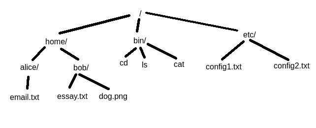

<main>

# Hacking Team: File Paths

Welcome to lesson number one Hacking Team! In this lesson,
we'll go over the basics of paths and how to navigate around
a system.

## A Tree of Files

Think of your filesystem like an upside-down tree. At the
top is the root of the tree. Each branch that grows from the
root may grow subsequent branches ad infinitum or end in a
leaf. In this example, branches represent directories and
leaves represent files. If you are unfamiliar with the term
"directory", just think of it like a "folder" in Windows
File Explorer.

Many tree-related analogs to filesystem elements persist
into real terminology. For example, the directory which
holds all others and has no parent directory is actually
called the root directory. "Tree" is another--`tree` is a
command which will display the branching structure of a
given directory.

Below is an example of a basic filesystem visualized as a
tree.

## Working Directory

When traversing the file system, we will always be "in" a
directory. This is called the current working directory.
Imagine opening a folder in File Explorer. That folder
becomes the new working directory. Usually, the working
directory starts as your user's home folder.

## Types of Paths

The location of anything---directory or file---is called a
path. There are two ways to write these paths. One is
determinant on your working directory; these are relative
paths. The other is not, and will refer to the same file or
directory regardless of your working directory; these are
absolute paths.

In other words, absolute paths are like giving your friend
an address to get to your house, while relative paths are
like giving directions. Your friend can find their way to
your house from anywhere, but your directions to your friend
must take into consideration their location.

Consider the example file tree graphic again.

### Absolute Paths

Let's start with absolute paths. Every absolute path starts
at the root directory, represented by a forward slash at the
start of the path: `/`. After that, we separate the name of
every branch we go down until we reach our target. For
example, the absolute path to `config1.txt` is
`/home/etc/config1.txt`.

Try some of the questions below!

What is the absolute path to `dog.png`?

`/home/bob/dog.png`

What is the absolute path to `alice/`?

`/home/alice/`

Here's a tricky one! What is the absolute path to
the root directory?

`/`

### Relative Path

Now, onwards with relative paths! Relative paths are
directions to a file or directory starting from your working
directory. For example, if the working directory is
`/home/`, the relative path to `email.txt` is
`alice/email.txt`.

Try some yourself!

If the working directory is `etc/`, what is the
relative path to `config2.txt`?

If the working directory is `/`, what is the
relative path to `bob/`?

`home/bob/`

Trick question! If the working directory is `alice/`,
what is the relative path to `cat`?

`../../bin/cat`

#### Going Back

If you did the last practice question for relative paths,
you may have noticed you needed to go **back up** the tree
instead of down like normal. This can be done with the
special `..` directory. The double-dot directory is actually
its parent's parent directory. In simpler terms, it takes
you one directory up.

Let's practice more relative paths using the double-dot.

If the working directory is `bob/`, what is the
relative path to `alice/`?

`../alice/`

If the working directory is `alice/`, what is the
relative path to `cd`?

`../../bin/cd`

Trick question! If the working directory is `/`, what directory
does `..` go to?

`..` leads to `/` as well! Remember that there is no
directory over the root directory.

</main>
